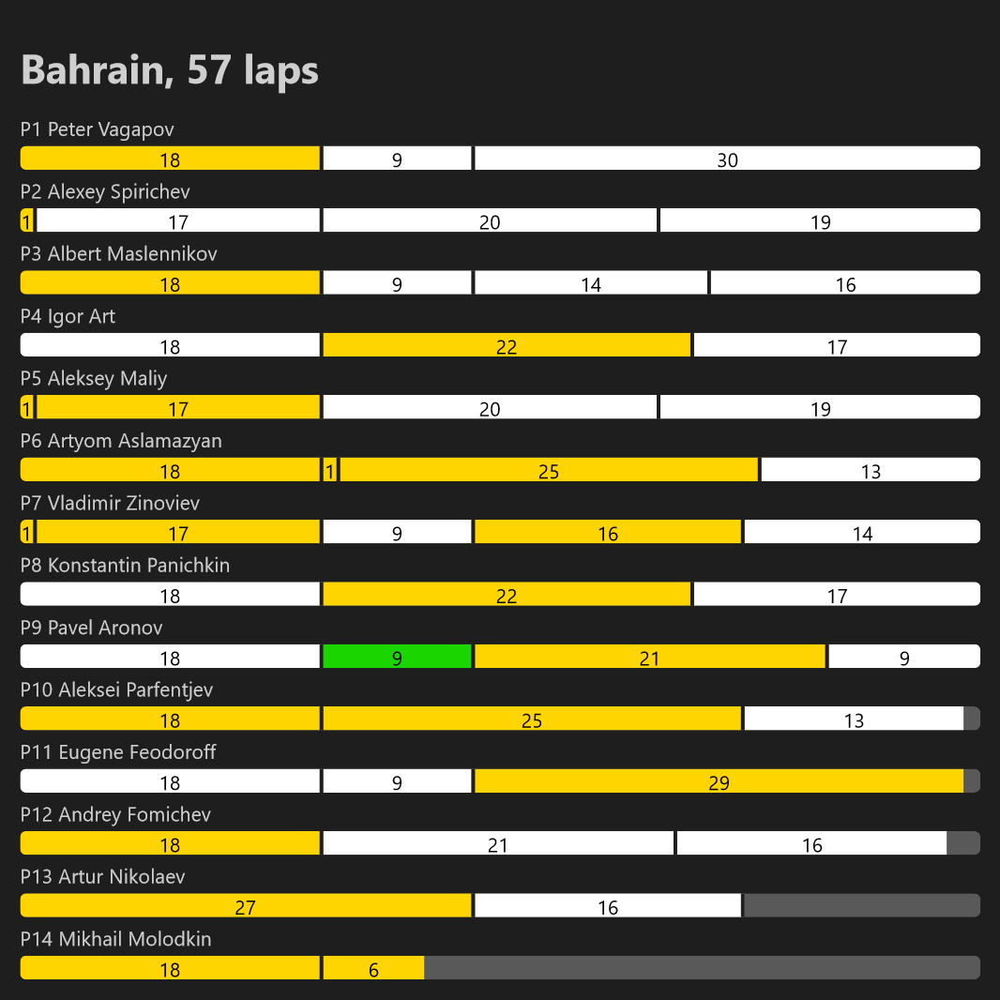
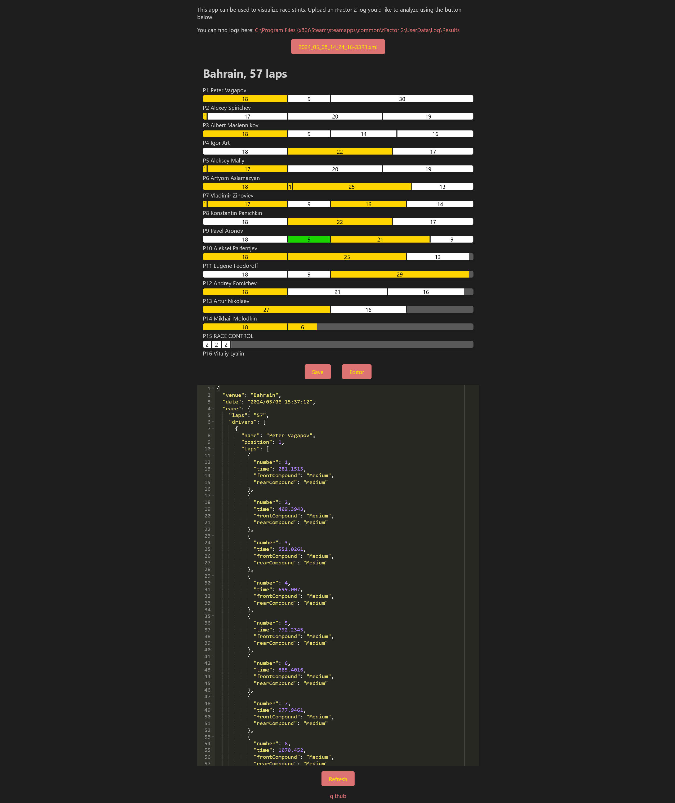

# rF2 Stint Visualizer

This is a simple React application designed to visualize racing stints using rFactor 2 logs. You can build it and serve it as a static website; it does not require any backend or database.

The stint analyzer is available [here](https://parfentjev.github.io/rf2-stint-visualizer/) thanks to GitHub Pages!

Currently, this application is a minimum viable product. It is configured to parse Formula Pro logs with the following tire mappings:

-   Soft => white color
-   Medium => yellow color
-   Hard => green color
-   Wet => blue color

If the tire name is not on this list, no color will be applied. Additionally, the code is a mess, but it is functional, so I decided to publish it.

## Example

Race results

App with the editor

## Issue with Logs

rFactor 2 logs present at least two major issues:

-   Tires are not always synchronized correctly with other drivers in the session.
-   Pit stops are not always synchronized correctly with other drivers in the session.

Unfortunately, this means that you need the server log to generate accurate reports; otherwise, some stints and tires will be displayed incorrectly.
